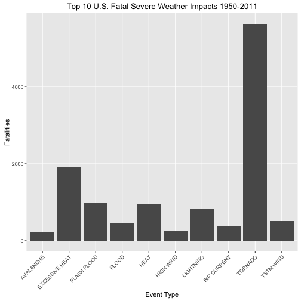
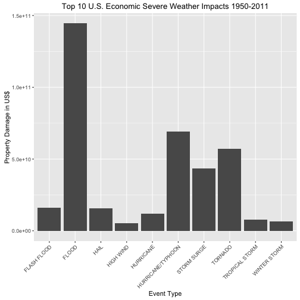

##Severe Weather Impacts in the United States from 1950 - 2011##

###Synopsis###

This analysis examines severe weather impact taken from the U.S. National Oceanic and Atmospheric Administration's (NOAA) storm database as it applies to the United States population's health and economy between the years of 1950 - 2011.

In particular, this data analysis will address the following questions:

1. Across the United States, which types of events (as indicated in the 𝙴𝚅𝚃𝚈𝙿𝙴 variable) are most harmful with respect to population health?

2. Across the United States, which types of events have the greatest economic consequences?

As the data analysis below demonstrates:

- **Tornados** are most harmful to *population health* as measured by **fatalities**
- **Flooding** has the greatest *economic impact* as measured by **property damage**

###Data Processing###

The data for this assignment can be downloaded from the course web site:

- [NOAA Storm Data (49Mb zipped/562Mb unzipped)](https://d396qusza40orc.cloudfront.net/repdata%2Fdata%2FStormData.csv.bz2)

Additional documentation for the data can be found here:

- [Storm Data Documentation (NWS)](https://d396qusza40orc.cloudfront.net/repdata%2Fpeer2_doc%2Fpd01016005curr.pdf)
- [FAQ (NCDCSE)](https://d396qusza40orc.cloudfront.net/repdata%2Fpeer2_doc%2FNCDC%20Storm%20Events-FAQ%20Page.pdf)

Other data processing notes:

- *No data pre-processing was performed on the raw data from the NOAA storm database prior to the analysis*

- *A DamageFactor function was used to transform the property damage data values into comparable figures*

- *The ggplot library was used to generate the plots in the results section*

Below is a summary of the dataset within the relevant working directory indicating 902,297 rows/observations and 37 columns/fields of data:


```r
setwd("~/datasciencecoursera/ReproRsrch/ProjectWk4/")
stormData <- read.csv("repdata-data-StormData.csv")
dim(stormData)
```

```
## [1] 902297     37
```

```r
head(stormData)
```

```
##   STATE__           BGN_DATE BGN_TIME TIME_ZONE COUNTY COUNTYNAME STATE
## 1       1  4/18/1950 0:00:00     0130       CST     97     MOBILE    AL
## 2       1  4/18/1950 0:00:00     0145       CST      3    BALDWIN    AL
## 3       1  2/20/1951 0:00:00     1600       CST     57    FAYETTE    AL
## 4       1   6/8/1951 0:00:00     0900       CST     89    MADISON    AL
## 5       1 11/15/1951 0:00:00     1500       CST     43    CULLMAN    AL
## 6       1 11/15/1951 0:00:00     2000       CST     77 LAUDERDALE    AL
##    EVTYPE BGN_RANGE BGN_AZI BGN_LOCATI END_DATE END_TIME COUNTY_END
## 1 TORNADO         0                                               0
## 2 TORNADO         0                                               0
## 3 TORNADO         0                                               0
## 4 TORNADO         0                                               0
## 5 TORNADO         0                                               0
## 6 TORNADO         0                                               0
##   COUNTYENDN END_RANGE END_AZI END_LOCATI LENGTH WIDTH F MAG FATALITIES
## 1         NA         0                      14.0   100 3   0          0
## 2         NA         0                       2.0   150 2   0          0
## 3         NA         0                       0.1   123 2   0          0
## 4         NA         0                       0.0   100 2   0          0
## 5         NA         0                       0.0   150 2   0          0
## 6         NA         0                       1.5   177 2   0          0
##   INJURIES PROPDMG PROPDMGEXP CROPDMG CROPDMGEXP WFO STATEOFFIC ZONENAMES
## 1       15    25.0          K       0                                    
## 2        0     2.5          K       0                                    
## 3        2    25.0          K       0                                    
## 4        2     2.5          K       0                                    
## 5        2     2.5          K       0                                    
## 6        6     2.5          K       0                                    
##   LATITUDE LONGITUDE LATITUDE_E LONGITUDE_ REMARKS REFNUM
## 1     3040      8812       3051       8806              1
## 2     3042      8755          0          0              2
## 3     3340      8742          0          0              3
## 4     3458      8626          0          0              4
## 5     3412      8642          0          0              5
## 6     3450      8748          0          0              6
```

###Results###


```r
popFatalSubset <- (subset(stormData, FATALITIES > 0))
popFatal <- aggregate(FATALITIES ~ EVTYPE, data = popFatalSubset, FUN = "sum", na.rm = TRUE)
popFatalDesc <- popFatal[order(popFatal$FATALITIES, decreasing=TRUE), ]
popFatalTop10 <- popFatalDesc[1:10, ]
print(popFatalTop10)
```

```
##             EVTYPE FATALITIES
## 141        TORNADO       5633
## 26  EXCESSIVE HEAT       1903
## 35     FLASH FLOOD        978
## 57            HEAT        937
## 97       LIGHTNING        816
## 145      TSTM WIND        504
## 40           FLOOD        470
## 116    RIP CURRENT        368
## 75       HIGH WIND        248
## 2        AVALANCHE        224
```

```r
library(ggplot2)
ggplot(popFatalTop10, aes(x=EVTYPE, y=FATALITIES)) +
  geom_bar(stat="identity") +
  xlab("Event Type") + 
  ylab("Fatalities") +
  ggtitle("Top 10 U.S. Fatal Severe Weather Impacts 1950-2011") + theme(axis.text.x = element_text(angle = 45, hjust = 1))
```




```r
DamageFactor <- function(amount, multiplier)
{
  factoredAmount <- 0
  if (toupper(multiplier)[1]=="K")
  {
    factoredAmount <- (amount * 1000)
  }
  if (toupper(multiplier)[1]=="M")
  {
    factoredAmount <- (amount * 1000000)
  }
  if (toupper(multiplier)[1]=="B")
  {
    factoredAmount <- (amount * 1000000000)
  }
  return(factoredAmount)
}
econDamageSubset <- (subset(stormData, PROPDMG > 0))
econDamageSubset$DamageFactor <- mapply(DamageFactor, econDamageSubset$PROPDMG, econDamageSubset$PROPDMGEXP)
econDamage <- aggregate(DamageFactor ~ EVTYPE, data = econDamageSubset, FUN = "sum", na.rm = TRUE)
econDamageDesc <- econDamage[order(econDamage$DamageFactor, decreasing=TRUE), ]
econDamageTop10 <- econDamageDesc[1:10, ]
print(econDamageTop10)
```

```
##                EVTYPE DamageFactor
## 64              FLOOD 144657709800
## 182 HURRICANE/TYPHOON  69305840000
## 334           TORNADO  56937160480
## 282       STORM SURGE  43323536000
## 51        FLASH FLOOD  16140811510
## 106              HAIL  15732266720
## 174         HURRICANE  11868319010
## 342    TROPICAL STORM   7703890550
## 399      WINTER STORM   6688497250
## 159         HIGH WIND   5270046260
```

```r
library(ggplot2)
ggplot(econDamageTop10, aes(x=EVTYPE, y=DamageFactor)) +
  geom_bar(stat="identity") +
  xlab("Event Type") + 
  ylab("Property Damage in US$") +
  ggtitle("Top 10 U.S. Economic Severe Weather Impacts 1950-2011") + theme(axis.text.x = element_text(angle = 45, hjust = 1))
```



To reiterate the conclusions first mentioned in the synopsis, the data analysis above demonstrates:

- **Tornados** are most harmful to *population health* as measured by **fatalities**
- **Flooding** has the greatest *economic impact* as measured by **property damage**
